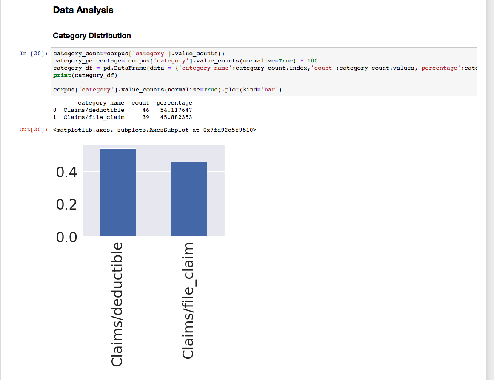
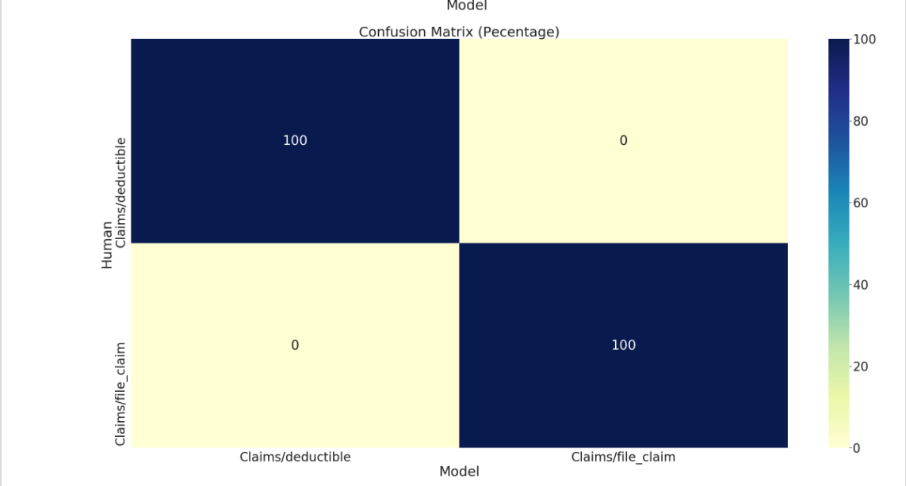
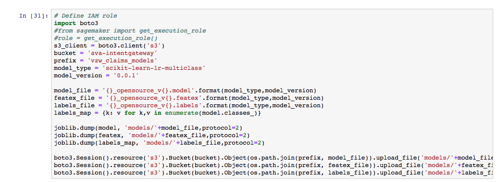

# Intent Gateway

Licensed under the GNU General Public License ver3 or later. GNU General Public License: http://www.gnu.org/licenses/

Platform: Python 2.7

* AVA-ML : Tools to train and deploy models from your browser -- compatible with AVA's Intent Gateway
* IntentGateway application -- classification, entity extraction, fuzzy pattern matching endpoints

Intent Gateway (IG) is a framework allowing users to quickly build and deploy machine learning models. The framework provides the ability to preprocess input and run the result through multiple models, run custom logic and output the best result

IG also includes a simple to use rules engine to supplement the machine learning models in cases where the number of training sample may be small or the input is short text snippets.

Rules - by adding a rule file to the configs folder IG is capable of supporting several types of rules. A rule file can contain several rule types per "rule name"
* Conditional match
* Span match
* Should not match
* Exact match

- - -


## AVA Platform and Docker


## Install and get setup with Docker

* Install Docker

[Installation : https://docs.docker.com/engine/installation/](https://docs.docker.com/engine/installation/)

[Mac: https://docs.docker.com/docker-for-mac](https://docs.docker.com/docker-for-mac)

[Windows : https://docs.docker.com/docker-for-windows/](https://docs.docker.com/docker-for-windows/)

* Run some Docker commands to get familiar

``docker ps``, ``docker version`` and ``docker info``

* Run ```docker run hello-world``` to test pulling an image from Docker Hub and starting a container.

- - -


## Create and run the image locally using Dockerfile in repository (AWS Required)

Access and clone the Intent Gateway repo


```
git clone https://<userid>@bitbucket.org/asurionlabs/ava-platform-image.git
```

```
git checkout -b ava-intent-gateway-os origin/ava-intent-gateway-os
```

```
cd IntentGateway
make build
```

```
docker run -it -p 5001:5001 --env RUN_LOCAL_CONTAINER=1 --env MODEL_BUCKET_NAME=ava-intentgateway --env PROFILE_NAME=asurion-dev.amadevops -v ~/.aws:/root/.aws -v <repo path>:/opt/app/IntentGateway t1:latest /bin/sh'
```

That's it! You can now use this image and run the container as we did above.


- - -  

## Training and deploying AVA-ML models in the browser (AWS Sagemaker notebooks)

You can build your model with your model with your preferred tool (Sagemaker, Jupyter, PyCharm), but it must be able to
access your Amazon S3 account to save the model to be retrieved by Intent Gateway. You can use the Jupyter notebook or
python scripts in the ava-ml sub-folder to visualize, train and deploy models that are compatible with Intent Gateway.


Visualize training data (labeled user chat transcripts)




Evaluate model performance



Save and deploy models ready to be used in the Intent Gateway



## Using AVA-ML models in the Intent Gateway

Intent classification API

```
http://localhost:5001/intentgateway/v2/intent-gateway
```

Request

```
POST /intentgateway/v2/intent-gateway HTTP/1.1
Host: internal-pss-ava-alcatraz-rt-dev-elb-2101119935.us-east-1.elb.amazonaws.com:5001
Content-Type: application/json
Cache-Control: no-cache

{
    "text": "file a claim",
    "version": "model_context_support_p2",
    "model_context": {
        "avaml": [
            "scikit-learn-lr-multiclass_opensource_v0.0.1"

        ],
        "rules": [
            "rulesparser_vzw_claims_first"
        ]
    },
    "threshold": 0.55,
    "dynamic_threshold": "yes",
    "api_version": "2.0.0"
}
```

Response

```
{
    "entities": [],
    "intents": [
        {
            "intent": "Claims/file_claim",
            "type": "rules.rulesparser_vzw_claims_first"
        },
        {
            "intent": "Claims/file_claim",
            "type": "avaml.scikit-learn-lr-multiclass_opensource_v0.0.1",
            "verbose": {
                "best": "Claims/file_claim",
                "scores": {
                    "Claims/deductible": "0.0",
                    "Claims/file_claim": "1.0"
                }
            }
        }
    ],
    "query": "file a claim"
}
```


- - - 

# Build the Intent Gateway Image

Docker can build images automatically by reading the instructions from a Dockerfile, a text file that contains all the commands, in order, needed to build a given image. Dockerfiles adhere to a specific format and use a specific set of instructions.

The sample Dockerfiles in the AVA Platform repo should cover a range of usecases for you to fork and customize your own image. More documentation here,

[Dockerfile reference](https://docs.docker.com/engine/reference/builder/)


- - -  


## Deploy the application as a service on ECS


We use EC2 Container Registry to host our platform images and define our applications as services and tasks on EC2 Container Service. Take a look at the script ``deploy-intent-gateway.sh`` for how you can automate your applications to run on ECS.


